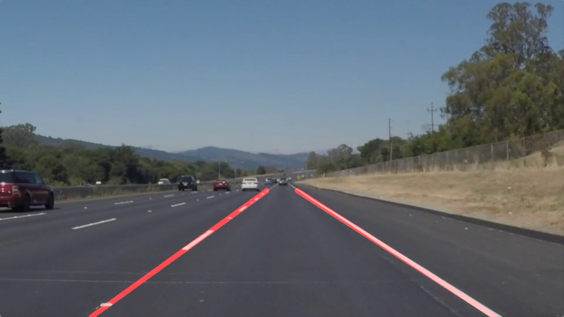
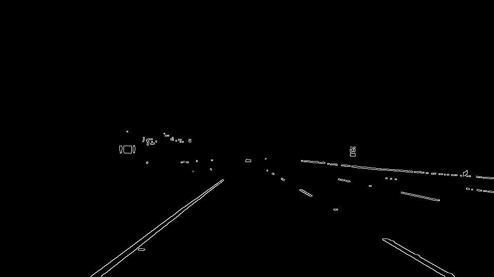

# **Identifying Lane Lines Using Python and OpenCV** 

<p align="center">

</p>

## Overview
As we are all moving from manually driven cars to the Self-Driving Cars, there is a need for huge innovation! To make a car to drive on its own we need a lot of complex systems. And **Lane Detection System** is one such system which falls under Level-1 of Advanced Driver Assistance Systems, in short **ADAS**.

This project walks you through the basic fundamental techniques used in detecting Lane Lines. The project is written in **Python** and uses various libraries like numpy and OpenCV's cv2. So let's get started!


## Pipeline stages
Identifying lane lines from an image requires image to be passed through multiple processes to enhance the lines and suppress the things which are out of our interest. Following are the pipeline stages used in this project.

  1. **Color Selection**
  2. **Canny Edge Detection**
  3. **Region of Interest** 
  4. **Hough Lines**
  5. **Averaging & Extrapolating**
  
  
## 1. Color Selection

Universally the lane lines on the road are marked in **_White_** and **_Yellow_**, and after trying with different color spaces found out that the colors Yellow and White are more prominent in **_HSL(Hue Saturation and Light)_** color space.

> ### **HSL color model**
<p align="center">

</p>

> ### **OpenCV & HLS Color Space Range**
An RGB image can be converted to HLS color space using OpenCV library
```python
HLS_image = cv2.cvtColor(ip_image, cv2.COLOR_RGB2HLS)
```
    Please note that HSL images in OpenCV are represented in the order "HLS" 

According to [OpenCV Documentation](https://docs.opencv.org/2.4/modules/imgproc/doc/miscellaneous_transformations.html?#cvtcolor) the H,L & S range for an 8bit image are as follows

    H: 0 to 180
    L: 0 to 255
    S: 0 to 255

> #### Filtering White Lines
From the above model you can easily observe that white colors are present at the top of the cylinder, i.e. higher Lightness value regardless of Hue and Saturation.
    
    Hue:        no-filter
    Lightness:  195 to 255
    Saturation: no-filter

> #### Filtering Yellow Lines

    Hue:        18 to 32
    Lightness:  120 to 255
    Saturation: 90 to 255
 
Images in HLS color space  
<p align="center">
   
</p>
 
Output images after 'color selection'
<p align="center">
   
</p>


## 2. Canny Edge Detection

Canny Edge Detection is a famous algorithm used in edge detection. Before passing through Edge detector, it is good practice to remove any unwanted noise in the image. So the steps are as follows.
1. Gray Scale
2. Smoothing (Gaussian Blur)
3. Edge Detection

The Canny Edge detector processes image based on gradient, so we will first convert the image to gray scale using OpenCV function
```Python
Gray = cv2.cvtColor(img, cv2.COLOR_RGB2GRAY)
```
Then we will apply Gaussian blur to suppress the noise in the image, you can chose different kernel size for smoothing the image, in this project we will chose 3.
```Python
Blur = cv2.GaussianBlur(Gray, (kernel_size, kernel_size), 0)
```

Now our image is ready to be passed through Canny algorithm, but we need to specify **lower and upper threshold** values for canny edge detection.

[OpenCV Documentation](http://docs.opencv.org/2.4/doc/tutorials/imgproc/imgtrans/canny_detector/canny_detector.html) says

- If a pixel gradient is higher than the upper threshold, the pixel is accepted as an edge
- If a pixel gradient value is below the lower threshold, then it is rejected.
- If the pixel gradient is between the two thresholds, then it will be accepted only if it is connected to a pixel that is above the upper threshold.

Canny recommended a upper:lower ratio between 2:1 and 3:1. For me 3:1 worked better
    
    low_threshold = 50
    high_threshold = 150
```Python
Edges = cv2.Canny(Blur, low_threshold, high_threshold)
```

The output images after 'Edge Detection'   
<p align="center">
   
</p>


## 3. Region of Interest
Since we know that the Lane lines are always present in the lower half of the frame within a known area, we can form a 4 sided polygon and filter out all the edges falling outside the polygon.
  
The 4 vertices I have chosen are
    
    (0.45*shape[1], 0.50*shape[0])
    (0.60*shape[1], 0.50*shape[0])
    (0,             0.97*shape[0])
    (shape[1],      0.97*shape[0])
  
  
So after applying ROI, the images look like
<p align="center">
   
</p>


## 4. Hough Lines
Now we have image with edges, next step is to find out the lines which make up for the Lane Lines.
Hough Transformation is a great technique to identify the straight lines.

OpenCV provides us ready to use function `HoughLinesP()` to identify lines using Hough Transformation. The syntax is as follows
```Python
Hough_Lines = cv2.HoughLinesP(img, rho, theta, threshold, np.array([]), minLineLength, maxLineGap)
```
According to [OpenCV documentation](https://docs.opencv.org/2.4/modules/imgproc/doc/feature_detection.html?highlight=houghlinesp#houghlinesp) the significance of input parameters is as follows
- img – 8bit, single-channel binary source image. The image may be modified by the function.
- rho – Distance resolution of the accumulator in pixels.
- theta – Angle resolution of the accumulator in radians.
- threshold – Only those lines are returned that get enough votes (**>threshold**).
- minLineLength – Minimum line length. Line segments shorter than that are rejected.
- maxLineGap – Maximum allowed gap between points on the same line to link them.

Following are the values which best suited in my case
    rho – 1
    theta – 1 degree
    threshold – 20
    minLineLength – 18
    maxLineGap – 300
    
```Python
Hough_Lines = cv2.HoughLinesP(edges, 1, np.pi/180, 20, 18, 300)
```
Hough_Lines has the list of x and y co-ordinates of end points of the lines.


## 4. Segregate, Average and Extrapolate
Next task is to average these lines and extrapolate them to mark the Lane with two straight lines extending from bottom of the frame till the visible end.

### Segregation:
All the lines belonging to right line will have positive slope, and all the left lines will have negative slope.
```Python
    for line in lines:
        for x1,y1,x2,y2 in line:
            if x1==x2:
                #check if it is a vertical line
                continue
            m, y = np.polyfit((x1,x2),(y1,y2),1)
            if ((abs(m) > 0.8 ) | (abs(m) < 0.3)):
                #check if it is a horizontal line
                continue
            if m > 0:
                right_m.append(m)
                right_y.append(y)
            else:
                left_m.append(m)
                left_y.append(y)
```
    
    Note that the above code also filters out any horizontal and vertical lines!    

### Averaging
Since all the detected lines may have slightly varying slopes, it is better to take average and draw a single line to make it look smoother.

`numpy` provides us ready to use function to find the average of above calculated slopes
```Python
    right_m_avg = np.average(right_m, axis=0)
    right_y_avg = np.average(right_y, axis=0)
    
    left_m_avg = np.average(left_m, axis=0)
    left_y_avg = np.average(left_y, axis=0)
```

### Extrapolating

The final step is to annotate the lines clearly on the input image. For this we have already found out average slope, and we also know y1 and y2 points. Now we can calculate x1 and x2 easily as follows

```Python
    y1 = int(img.shape[0])
    y2 = int(0.60*(img.shape[0])
    
    m = right_m_avg
    y = right_y_avg
    x1 = int((y1 - y)/m)
    x2 = int((y2 - y)/m)
```
Now we can easily draw the lines on the image using `cv2.line()` function.

```Python
cv2.line(img, (x1, y1), (x2, y2), color, thickness)
```

above function draws a straight line from (x1,y1) to (x2,y2) on image `img`. And the line thickness can be specified with `thickness` in pixels.

Tada! We are done. The final image looks like this...
<p align="center">
   
</p>

## Improvements

This project can be improved by adding a feedback system while calculating the slopes, the lines can be made smoother by adding current average slope and the previous average slope, and then dividing by 2.


