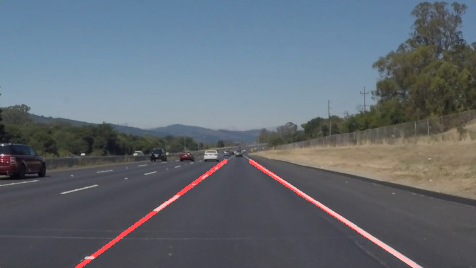

# **Identifying Lane Lines Using Python and OpenCV** 

## Overview
As we are all moving from manually driven cars to the Self-Driving Cars, there is a need for huge innovation! To make a car to drive on its own we need a lot of complex systems. And **Lane Detection System** is one such system which falls under Level-1 of Advanced Driver Assistance Systems, in short **ADAS**.

This project walks you through the basic fundamental techniques used in detecting Lane Lines. The project is written in **Python 3.6** and uses various libraries like numpy and OpenCV's cv2. So let's get started!

Please refer `Project_Writeup.md` for detailed information regarding the step by step techniques used in this project.

## The Project contains following files:

- **test_images/**        : Contains the test input images
- **test_images_output/** : Contains the annoted output images
- **test_videos/**        : Contains sample test videos
- **test_videos_output/** : Contains the annoted putput video
- **PipelineStages/**     : Contains the intermediate output images after every pipeline stage
- **Project_Writeup.md**  : Explains the techniques used in this project
- **P1.ipynb**            : Jupyter Notebook file containing the **project code**

## Environmnet Setup:
- Make sure Pyhton and OpenCV and other libraries are available on the system
- Download and install [Jupyter Notebook](https://jupyter.org/).

## To run this notebook: 
- clone or download this project
- Open Jupyter notebook
- Navigate to the project folder and Open 'P1.ipynb'
- Now you can `run` all the cells
